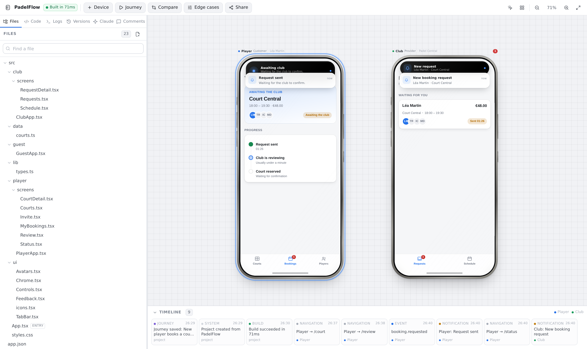

# PhoneLab

**Claude builds the app. PhoneLab is its workshop.**

A desktop studio for mobile app projects: the code on the left, real interactive
phones on a canvas on the right. Give each phone a role, watch an action on one
device arrive on another, snapshot a version, share it for review — and let Claude
edit the same project through an MCP connector you add with your own subscription.



---

## Run it

```bash
npm install
npm run dev          # http://localhost:3000
```

That is the whole setup. With no configuration PhoneLab uses a file-backed storage
driver under `.phonelab-data/`, so your account and projects survive restarts.

Then:

1. Create an account at **`http://localhost:3000/signup`**. You land straight on
   **`/onboarding`**.
2. Answer four short questions — what you are building, who uses it, whether to
   connect Claude, and what to start from. Every answer is saved as you give it,
   so closing the tab resumes rather than restarts.
3. Finish. PhoneLab generates a real project from your brief — files, one phone
   per role, a first version snapshot and a recorded journey — and drops you in
   the studio.
4. Prefer to see the reference project? Pick **PadelFlow demo** on the last step.
   You get a player phone and a club phone running the same codebase as different
   roles. Book a court on the player phone: the club phone gets a notification,
   its Dynamic Island expands, and the timeline records the event.

You can skip onboarding at any point, and reopen it later from the profile menu
or **Settings → Account → Revisit onboarding**. Reopening it never touches your
projects.

### Other commands

| Command | What it does |
| --- | --- |
| `npm run dev` | Development server (regenerates templates + preview runtime first) |
| `npm run build` / `npm start` | Production build and server |
| `npm run verify` | Lint, typecheck and unit tests |
| `npm test` | Unit tests only (150 tests) |
| `npm run gen` | Rebuild generated sources: template bundles + the preview runtime |
| `node scripts/verify-e2e.mjs http://localhost:3000` | End-to-end smoke test against a running server (103 checks) |
| `npm run smoke:production <url>` | Post-deploy check against a **deployed** URL — refuses localhost |

Editing anything under `templates/` or `src/preview/runtime/` requires
`npm run gen` — both are compiled into `src/generated/`.

---

## What it does

**Several phones, several roles.** A device carries a preset, an orientation, a
role, a simulated signed-in user, a pinned version, a theme, a locale and its own
set of edge-case flags. Two phones with different roles render different sides of
the same codebase.

**A canvas that gets out of the way.** Pan, zoom (⌘-scroll or pinch), drag, snap to
neighbours with alignment guides, align, distribute, tidy, fit. Dragging a phone
never reloads its preview, so the app keeps its state while you rearrange.

**Previews that actually run.** Your project is compiled server-side with esbuild
and executed inside a sandboxed iframe: real navigation, real forms, real session
state. User code never runs in PhoneLab's process.

**Code ↔ preview.** The compiler stamps every DOM node with its source location, so
the inspector turns a click inside a phone into the exact file and line — with no
annotations in your code.

**Versions.** Snapshot the working tree, restore it exactly (a safety snapshot is
always taken first), or run two versions side by side on two phones with the diff
next to them.

**Journeys.** Record a path through the app — taps, entries, cross-device events —
then replay it step by step at any speed, with a report.

**Edge Case Studio.** Slow connection, offline, server error, payment declined,
expired session, empty data, denied permissions, keyboard open, long text, dark
mode, another language. Applied per phone, so you can compare four states at once.

**Sharing.** Generate a link pinned to a version. The reviewer gets the running app
and can leave comments anchored to a screen, a role and an element — never the code.

**Claude, through MCP.** 52 tools across projects, files, preview, devices,
versions, journeys and sharing. Every call is audited and visible live in the studio.

---

## Connecting Claude

PhoneLab exposes a remote MCP server at `/api/mcp`, implementing the
[Model Context Protocol](https://modelcontextprotocol.io) revision **2025-11-25**
over Streamable HTTP, protected by OAuth 2.1.

1. Copy the connector URL from your dashboard (it is `<your-origin>/api/mcp`).
2. In Claude, add it as a custom connector.
3. Claude registers itself via Dynamic Client Registration and sends you to
   PhoneLab's consent screen, where you choose the scopes.
4. Ask Claude to open one of your projects by name.

PhoneLab never sees your Claude conversations, cookies, session or quota. It
receives tool calls and nothing else. Full details, the live tool list and the
limits are at `/docs/mcp` in the running app, and in [docs/MCP.md](docs/MCP.md).

The server must be reachable from the public internet for Claude to connect. To
test locally, mint a personal access token on the dashboard and point MCP Inspector
or `curl` at the endpoint.

---

## Deploying

Deploying to Vercel: [docs/VERCEL.md](docs/VERCEL.md). Elsewhere:
[docs/DEPLOY.md](docs/DEPLOY.md). The short version:

- **`SUPABASE_URL` and `SUPABASE_SERVICE_ROLE_KEY` are required in production.**
  PhoneLab refuses to start without them rather than falling back to the
  file-backed driver — that driver writes under `process.cwd()`, which is
  read-only inside a Lambda, and a deployment using it can serve pages while
  being unable to create a single account.
- Apply `supabase/migrations/0001_init.sql`, then `0002_onboarding.sql`.
- Set `PHONELAB_BASE_URL` to your public origin — it is the OAuth issuer and the
  audience that access tokens are bound to.
- Node runtime required (esbuild compiles previews server-side).
- Then check it: `curl <origin>/api/health` and
  `npm run smoke:production <origin>`.

---

## Documentation

| Document | What is in it |
| --- | --- |
| [docs/ARCHITECTURE.md](docs/ARCHITECTURE.md) | How the pieces fit: storage, preview, realtime, canvas, security |
| [docs/MCP.md](docs/MCP.md) | The connector: transport, OAuth, every tool, limits |
| [docs/STATUS.md](docs/STATUS.md) | **What is real, what is simulated, what is not built** |
| [docs/DEPLOY.md](docs/DEPLOY.md) | Production setup |
| [docs/VERCEL.md](docs/VERCEL.md) | **Deploying to Vercel: required variables, migrations, health check, smoke test** |

`docs/STATUS.md` is the honest inventory. If you read one thing before judging what
this is, read that.

---

## Routes

| Route | What it is |
| --- | --- |
| `/` | Landing page. Signed in, it routes you: onboarding if you have never seen it, otherwise the dashboard |
| `/signup`, `/login` | Account creation and sign-in. A new account always goes to `/onboarding` first |
| `/onboarding` | The five-step first run. `?again=1` reopens it after you have finished |
| `/dashboard` | Your projects, the demo, and the Claude connector card |
| `/projects/new` | Describe an app and generate it, or start from a template |
| `/studio/<projectId>` | The studio: code on the left, phones on a canvas on the right |
| `/settings` | Name and studio preferences (stored on the account, not the browser) |
| `/settings/connections` | Claude connections, scopes, personal access tokens |
| `/settings/workspace` | Workspace name, counts, members |
| `/share/<token>` | The reviewer surface — no account needed |
| `/docs/mcp` | Connector setup and the tool list |
| `/app` | Redirects to `/dashboard`. Kept because it used to be the dashboard |

---

## Repository layout

```
src/
  app/                     Next.js routes — pages, REST API, MCP endpoint, OAuth
  components/
    studio/                The studio: canvas, phone, panels, store
      canvas/              Geometry, phone chassis, overlays, preview frames
      left/                Files, Code, Logs, Versions, Claude, Comments
    onboarding/            The five-step first run
    dashboard/             Project list, project creation, connector card
    settings/              Account, connections, workspace
    app-shell/             Header and profile menu shared outside the studio
    share/                 The reviewer surface
    ui/                    Design-system primitives
  lib/                     Shared: device presets, roles, edge cases, diff, protocol
  preview/
    runtime/               Layer A — runs inside the sandboxed iframe
    host/                  The sandboxed host document
  server/
    db/                    Schema + the two storage drivers
    services/              Domain logic: the single source of truth for REST and MCP
    mcp/                   Tool registry, runner, JSON-RPC dispatch
    oauth/                 OAuth 2.1 authorization server
    preview/               esbuild bundler over a virtual filesystem
    realtime/              Event bus and studio RPC
templates/                 Project templates as real, readable files
supabase/migrations/       Postgres schema
tests/                     Unit and integration tests
scripts/                   Codegen, asset copying, end-to-end smoke test
```

---

## A note on device presets

Presets describe **viewport formats** for testing — dimensions, corner radii, safe
areas, cutout geometry. Every frame is drawn with CSS and SVG from those numbers.
There are no vendor assets, logos, marketing images or fonts anywhere in this
repository, and PhoneLab is not affiliated with, endorsed by, or sponsored by any
device manufacturer.
